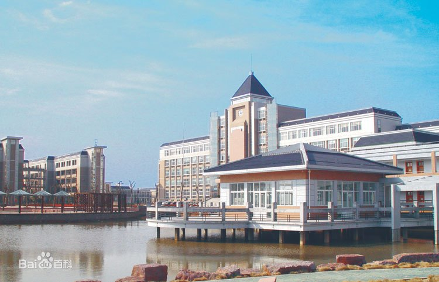

# 我眼中的丽泽

## 目录

- [丽泽书院简介](#introduction-of-lize)
- [丰富的校园生活](#interesting-school-life)
- [超好的老师](#very-good-teachers)

## Introduction of Lize

丽泽书院,坐落在湖海塘畔,目前在金一中内上课,下面是一段来自我们学校同学对我们学校的描写

> The school is so attractive that I like it so much. There is a classroom building surround by water on three sides. A sports hall that can shelter us from the wind and rain is in front of dining hall. you will see a big playground on your right when you walk out of the classroom building...

这段话大概是在说

> 这所学校很吸引人，我非常喜欢它。教学楼三面环水。饭厅前有一个能遮风挡雨的运动。当你走出教学楼时，你会看到一个大操场在你的右边...

十分生动而又细致的描写

不过我们的学校才不仅如此，还有更为丰富的校园生活。

下面是我们的教学楼图片

## Interesting school life

我们学校的校园生活充实而又丰富，在保证学业的同时，每天至少有一个小时的运动，我们有趣的体育老师——化哥

相信所有同学们在体育课上一定被"嘟"折腾过吧，没错，20个来回的折返跑。

还有我们的生活胡老师，天天晚上不知道要查多少次寝，不过一些同学特意等到老师不再查寝然后开始……。

四人一个的寝室，特别有趣，有时谁没有好好值日，寝室扣分了，那可能就是剩下三人的惩罚，是“体罚”还是罚值日，可能各个寝室都有自己的一套吧。

还有那赫赫有名的食堂，有三个食堂，不是价格实惠，就是味道美味，当年可能想来丽泽的一大理由就是食堂吧，想想都流口水。

## Very good teachers

